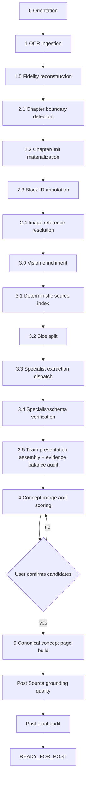

# [X]-Library Extraction Pipeline Flowchart.

Date: 2026-06-11  

## Flowchart

## Phase-by-phase operating contract

| Phase                                    | Activated when                                   | What occurs                                                                                                                                                                                                                                  | Primary outputs                                                                                                                                                                                           | Gate condition                                                                                                                                               |
| ---------------------------------------- | ------------------------------------------------ | -------------------------------------------------------------------------------------------------------------------------------------------------------------------------------------------------------------------------------------------- | --------------------------------------------------------------------------------------------------------------------------------------------------------------------------------------------------------- | ------------------------------------------------------------------------------------------------------------------------------------------------------------ |
| 0 — Orientation                          | A new book-ingestion run starts.                 | Load pipeline skills, wiki contracts, graph vocabulary, `index.md`, `log.md`, and `.gitignore`; establish slug/title/author/PDF path.                                                                                                        | Oriented session context.                                                                                                                                                                                 | Required skills/files exist; ignore rules protect secrets and processing debris.                                                                             |
| 1 — OCR ingestion                        | Phase 0 is complete and the source PDF exists.   | `quantlib_phase1_glmocr.py` splits long PDFs into API-safe chunks, runs GLM OCR, downloads crop images locally, rewrites OCR JSON image paths to local files, and writes combined OCR markdown/JSON.                                         | `raw/papers/$SLUG/glmocr_output/`, `combined.json`, `book.md`, Phase 1 gate.                                                                                                                              | API JSON is valid; every remote crop/image URL is materialized locally; gate is `PASS`.                                                                      |
| 1.5 — Fidelity reconstruction            | Phase 1 output exists.                           | The Phase 1 runner resolves OCR paths and reconstructs `book_fidelity.md` with image preservation and fidelity statistics.                                                                                                                   | `book_fidelity.md`, `phase-1.5-stats.json`, Phase 1.5 gate.                                                                                                                                               | Fidelity is at least 95%; no missing local images; pipeline state marks phases 1 and 1.5 complete.                                                           |
| 2.1 — Chapter boundary detection         | Phase 1.5 is `PASS`.                             | `quantlib_phase2_chapters.py` detects chapter boundaries from `book_fidelity.md`; if needed, explicit TOC-derived manual boundaries are supplied. Fixed-size fallback chunks are forbidden.                                                  | Phase 2.1 gate and optional `chapter-boundaries.json`.                                                                                                                                                    | Boundary method is recorded and reproducible; fallback chunking fails the gate.                                                                              |
| 2.2 — Chapter/unit materialization       | Phase 2.1 is `PASS`.                             | Writes canonical chapter markdown files, validates extraction units, writes `manifest.json`, and advances state to `READY_FOR_2.3`.                                                                                                          | `raw/papers/$SLUG/chapters/*.md`, `manifest.json`, Phase 2.2 gate.                                                                                                                                        | Unit count matches manifest/boundaries; no duplicate unit IDs; no unintentional overwrite.                                                                   |
| 2.3 — Block ID annotation                | Phase 2.2 is `PASS`.                             | `quantlib_phase23_blocks.py` annotates substantive chapter lines with same-slug block IDs and validates ID integrity.                                                                                                                        | Inline block IDs, `block_annotator-report.json`, Phase 2.3 gate.                                                                                                                                          | Every substantive manifest file has valid same-slug block IDs; no duplicates, wrong slugs, malformed IDs, or fallback chunks.                                |
| 2.4 — Image reference resolution         | Phase 2.3 is `PASS`.                             | `quantlib_phase24_images.py` copies/rebases image refs into `chapters/images/`, forbids remote/data refs, and writes the image-ref report.                                                                                                   | Local chapter image refs, `image-refs-report.json`, Phase 2.4 gate.                                                                                                                                       | Zero missing refs; zero remote/data refs; OCR-image books have resolved local refs.                                                                          |
| 3.0 — Vision enrichment                  | Phase 2.4 is `PASS`.                             | `quantlib_phase30_vision.py` verifies local chapter images, scans for `VISION_*_NEEDED` markers, writes one orchestrator vision log per unit, and resolves or fails markers.                                                                 | `team-<unit_id>/orchestrator-vision-enrichment.md`, `vision-enrichment-report.json`, Phase 3.0 gate.                                                                                                      | No unresolved vision markers; every unit has a vision log and local image manifest.                                                                          |
| 3.1 — Deterministic source index         | Phase 3.0 is `PASS`.                             | `quantlib_phase31_source_index.py` builds one deterministic source index per current unit using regex/heuristic classification and exact block coverage validation.                                                                          | `team-<unit_id>/orchestrator-source-index.md`, `source-index-report.json`, Phase 3.1 gate.                                                                                                                | Every same-slug block ID appears exactly once in the correct unit source index; no extras or invalid categories.                                             |
| 3.2 — Size split                         | Phase 3.1 is `PASS`.                             | `quantlib_phase32_size_split.py` enforces the 2000-line zero-overlap policy, splits oversized units, archives superseded team dirs, and regenerates unit prerequisites.                                                                      | Split unit files, refreshed vision/source-index artifacts, `size-split-report.json`, Phase 3.2 gate.                                                                                                      | No active unit exceeds 2000 lines; no duplicate block IDs; current unit artifacts exist.                                                                     |
| 3.3 — Specialist extraction dispatch     | Phase 3.2 is `PASS`.                             | `quantlib_phase33_omp_dispatch.py --prepare` creates named-lane tasks. Dispatch should run one chapter at a time through the configured specialist model, then `--record` stores job IDs and writes the gate.                                | `omp-specialist-dispatch.json`, `omp-dispatch-result.json`, `specialist-dispatch-report.json`, Phase 3.3 gate.                                                                                            | Every current unit/lane pair has a recorded job ID plus expected markdown and schema output paths; Phase 3.3 is not `PASS` after prepare alone.              |
| 3.4 — Specialist/schema verification     | Phase 3.3 is `PASS`.                             | `quantlib_phase34_verify.py` checks every lane markdown for required sections, no slop markers, same-unit citations, and validates every schema JSON draft.                                                                                  | `specialist-verification.json`, `schema-validation-report.json`, `_validation_passed`, `pipeline-run-manifest.json`, Phase 3.4 gate.                                                                      | All named outputs exist, are non-empty, cite valid same-unit block IDs, and schema validation is non-empty `PASS`.                                           |
| 3.5 — Team presentation assembly         | Phase 3.4 is `PASS`.                             | `quantlib_phase35_presentations.py` assembles one validated `team-<unit_id>-presentation.md` from verified lane outputs, updates the run manifest, and writes an advisory evidence-balance audit across presentation sections.               | Team presentations, `presentation-report.json`, `presentation-evidence-balance-audit.json/.md`, Phase 3.5 gate.                                                                                           | Required sections occur exactly once; each section is source-anchored; enough block embeds and Author's Words quote lines exist; audit artifacts are linked. |
| 4 — Concept merge, scoring, confirmation | Phase 3.5 is `PASS`.                             | `quantlib_phase4_merge_score.py --prepare` merges schema drafts, scores concepts, filters artifact slugs, validates block IDs, and presents candidates plus a rationale packet. After Niko selection, `--confirm` writes confirmed concepts. | `master-scored.json`, `master-top-clean.json`, `concept-selection-candidates.md/json`, `concept-selection-rationale-packet.md/json`, `phase4-user-selection.json`, `master-confirmed.json`, Phase 4 gate. | Prepare stops at `AWAITING_USER_CONFIRMATION`; rationale covers every scored concept; `PASS` requires explicit non-empty user-confirmed slugs.               |
| 5 — Canonical page build                 | Phase 4 confirmation is `PASS`.                  | `quantlib_phase5_pages.py` writes confirmed concept pages from validated team presentations only, updates navigation/log files, and validates page form.                                                                                     | `concepts/*.md`, `page-build-report.json`, Phase 5 gate.                                                                                                                                                  | Pages include required sections, deterministic YAML, source edges, block embeds, substantial quotes, and valid active chapter block IDs.                     |
| Post — Source grounding and final audit  | Phase 5 is `PASS` and state is `READY_FOR_POST`. | Run `source_grounding_quality.py` with explicit wiki path, chapters dir, and image report; then run `quantlib_audit.py` to produce the final audit report.                                                                                   | `lexical-overlap-report.*`, `image-to-page-coverage.*`, final audit JSON.                                                                                                                                 | Audit exits 0 or remaining failures are explicitly explained; low-overlap and image warnings are cleared or justified.                                       |

## Detailed control flow

```mermaid
flowchart LR
    subgraph Ingest[OCR and source preparation]
        P0[Orient] --> P1[OCR chunks]
        P1 --> P15[Fidelity markdown]
        P15 --> P21[Detect boundaries]
        P21 --> P22[Write chapters]
        P22 --> P23[Annotate blocks]
        P23 --> P24[Resolve images]
    end

    subgraph Orchestrator[Orchestrator deterministic passes]
        P24 --> P30[Vision logs]
        P30 --> P31[Source indexes]
        P31 --> P32[Size split]
    end

    subgraph Extraction[Specialist extraction]
        P32 --> P33[Dispatch chapter batch]
        P33 --> P34[Verify lanes and schemas]
        P34 --> P35[Assemble team presentation + audit evidence balance]
    end

    subgraph Publication[Concept publication]
        P35 --> P4[Score candidates]
        P4 --> Confirm{User confirmation}
        Confirm --> P5[Write pages]
        P5 --> Post[Quality reports and audit]
    end
```

# 

