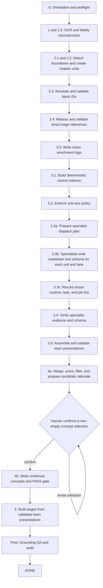

# Domain-Library Pipeline Flowchart / Operator Guide

This document showcases the runnable, gate-controlled pipeline in `_meta/scripts/`.

Run `python3 library.py next --slug <slug>` before and after each phase. It reads the state and gate files and gives the next action.

The configured lane set, output filenames, and required sections all are borne of `_meta/config/domain.json`; do not hard-code example lane names in a run. 

Each phase runner fails closed: a failed gate blocks the next phase from running until the underlying cause is fixed by the orchestrator and that runner is rerun. `--prepare` in Phase 3.3 and Phase 4 is not a pass gate.

To invalidate derived phase metadata without deleting inputs or artifacts, run
`domain-library rerun --slug "$SLUG" --from 3.3 --yes`. It marks the named
phase and later existing gates `STALE`, then `domain-library next` prints the
canonical command for the selected phase. `--yes` is required; it never deletes
files.

Phase 2 records SHA-256 fingerprints for `book_fidelity.md` and the active
`chapter-boundaries.json`, when present. A repeated invocation with matching
inputs prints `SKIP (unchanged)` before it touches state, gates, manifests, or
chapters. This is distinct from `--force`, which retains its documented
overwrite behavior.

Specialist JSON claims use `EXTRACTED`, `INFERRED`, or `AMBIGUOUS` confidence.
Phase 3.4 checks every `EXTRACTED` `quote_verbatim` span against the cited
source-index block. A mismatch is reported as `AMBIGUOUS`; a lane fails only
when more than 20% of its EXTRACTED claims are demoted. Phase 4 down-weights
ambiguous evidence and presents it under `Needs human eyes`; Phase 5 marks
INFERRED claims with `⚠`.

## Flowchart

## Runnable phase contract

| Phase                            | Runner / action                                                                                                                                                                                                                                                                                                                                        | State after success          | Key outputs and gate                                                                                                                                                                                                                    |
| -------------------------------- | ------------------------------------------------------------------------------------------------------------------------------------------------------------------------------------------------------------------------------------------------------------------------------------------------------------------------------------------------------ | ---------------------------- | --------------------------------------------------------------------------------------------------------------------------------------------------------------------------------------------------------------------------------------- |
| 0 — Orientation                  | Read `_meta/contracts/PAGE_SCHEMA.md`, `_meta/contracts/VOCABULARY_GUIDE.md`, `index.md`, and `log.md`; validate the configured lanes in `_meta/config/domain.json`; ensure `.gitignore` protects local secrets and transient files.                                                                                                                                                   | Ready to start.              | Operator context; no phase gate.                                                                                                                                                                                                        |
| 1 + 1.5 — OCR and fidelity       | `python3 library.py start --slug "$SLUG" --pdf "$PDF_PATH" [--title "$TITLE" --author "$AUTHOR"]` (calls `library_phase1_ocr.py`).                                                                                                                                                                                                                     | `READY_FOR_2.1`              | `glmocr_output/combined.json`, local OCR image assets, `book.md`, `book_fidelity.md`, `phase-1.json`, and `phase-1.5.json`. The one runner writes both gates.                                                                           |
| 2.1 + 2.2 — Boundaries and units | `domain-library run library_phase2_chapters --slug "$SLUG"`                                                                                                                                                                                                                                                                                      | `READY_FOR_2.3`              | `chapter-boundaries.json` when manual TOC boundaries are needed, `chapters/*.md`, `manifest.json`, `phase-2.1.json`, and `phase-2.2.json`. Fixed-size fallback chunks fail the canonical gate; the one runner writes both gates.        |
| 2.3 — Block IDs                  | `domain-library run library_phase23_blocks --slug "$SLUG"`                                                                                                                                                                                                                                                                                       | `READY_FOR_2.4`              | Same-slug inline block IDs, `block_annotator-report.json`, and `phase-2.3.json`.                                                                                                                                                        |
| 2.4 — Images                     | `domain-library run library_phase24_images --slug "$SLUG"`                                                                                                                                                                                                                                                                                       | `READY_FOR_3.0`              | Rebased `chapters/images/`, `image-refs-report.json`, and `phase-2.4.json`. Remote and data URLs are rejected.                                                                                                                          |
| 3.0 — Vision enrichment          | `domain-library run library_phase30_vision --slug "$SLUG"`                                                                                                                                                                                                                                                                                       | `READY_FOR_3.1`              | One `orchestrator-vision-enrichment.md` per unit, `vision-enrichment-report.json`, and `phase-3.0.json`. Unresolved `VISION_*_NEEDED` markers fail.                                                                                     |
| 3.1 — Source index               | `domain-library run library_phase31_source_index --slug "$SLUG"`                                                                                                                                                                                                                                                                                 | `READY_FOR_3.2`              | One `orchestrator-source-index.md` per unit, `source-index-report.json`, and `phase-3.1.json`. Every current same-slug block is indexed exactly once.                                                                                   |
| 3.2 — Size split                 | `domain-library run library_phase32_size_split --slug "$SLUG"`                                                                                                                                                                                                                                                                                   | `READY_FOR_3.3`              | Active units no larger than 2,000 lines, `size-split-report.json`, refreshed vision/index artifacts, and `phase-3.2.json`. Splits have zero overlap.                                                                                    |
| 3.3 — Specialist dispatch        | Run `domain-library run library_phase33_dispatch --slug "$SLUG" --prepare`; use the generated plan to launch native specialist tasks; write `_meta/extractions/$SLUG/dispatch-result.json`; then run `domain-library run library_phase33_dispatch --slug "$SLUG" --record --dispatch-result _meta/extractions/$SLUG/dispatch-result.json`. | `READY_FOR_3.4`              | `specialist-dispatch-plan.json`, `specialist-dispatch-report.json`, one markdown and schema draft per unit × configured lane, and `phase-3.3.json`. Recording requires real runtime, model, runtime task ID, and job ID for every task. |
| 3.4 — Specialist verification    | `domain-library run library_phase34_verify --slug "$SLUG"`                                                                                                                                                                                                                                                                                       | `READY_FOR_3.5`              | `specialist-verification.json`, `schema-validation-report.json`, machine-owned `_validation_passed`, `pipeline-run-manifest.json`, and `phase-3.4.json`. It validates the recorded lane outputs only; presentations do not exist yet.   |
| 3.5 — Team presentation          | `domain-library run library_phase35_presentations --slug "$SLUG"`                                                                                                                                                                                                                                                                                | `READY_FOR_4`                | One `team-<unit_id>-presentation.md` per current unit, `presentation-report.json`, advisory presentation-evidence-balance audits, and `phase-3.5.json`.                                                                                 |
| 4a — Candidate preparation       | `domain-library run library_phase4_merge_score --slug "$SLUG" --prepare`                                                                                                                                                                                                                                                                         | `AWAITING_USER_CONFIRMATION` | Scored and clean candidate sets, candidate and rationale packets, block-ID validation, and `phase-4.json` with status `AWAITING_USER_CONFIRMATION`.                                                                                     |
| 4b — Human confirmation          | A human writes `_meta/extractions/$SLUG/phase4-user-selection.json` with non-empty `confirmed_slugs`, then run `domain-library run library_phase4_merge_score --slug "$SLUG" --confirm --selection _meta/extractions/$SLUG/phase4-user-selection.json`.                                                                                          | `READY_FOR_5`                | `phase4-confirmation.json`, `master-confirmed.json`, and a `PASS` Phase 4 gate.                                                                                                                                                         |
| 5 — Page build                   | `domain-library run library_phase5_pages --slug "$SLUG"`                                                                                                                                                                                                                                                                                         | `READY_FOR_POST`             | `concepts/*.md`, `page-build-report.json`, `phase-5.json`, plus updated `index.md` and `log.md`. Pages are written only for confirmed concepts and derive prose/evidence from validated Phase 3.5 presentations.                        |
| Post — Finalization              | `domain-library run library_audit --slug "$SLUG" --wiki . --report _meta/reports/audit-$SLUG.json [--ack CHECK_ID,...]`                                                                                                                                                                                                                          | `DONE`                       | Lexical-overlap and image-coverage grounding reports, final audit JSON, `phase-post.json`, and the `DONE` state. `library_audit.py` runs both grounding QA and audit; there is no separate post command.                                |

## Control boundaries

```mermaid
graph LR
    subgraph source_preparation["Deterministic source preparation"]
        source_ocr["OCR and fidelity"] --> source_units["Chapter units"] --> source_blocks["Block IDs"] --> source_images["Local image references"]
    end

    subgraph orchestration["Deterministic orchestration"]
        source_images --> vision_logs["Vision logs"] --> source_indexes["Source indexes"] --> size_policy["Size policy"]
    end

    subgraph specialist_work["Native specialist work verified by runners"]
        size_policy --> prepare_plan["Prepare plan"]
        prepare_plan --> worker_tasks["One task per current unit and configured lane"]
        worker_tasks --> record_jobs["Record actual jobs and output paths"]
        record_jobs --> verify_outputs["Verify markdown and schemas"]
        verify_outputs --> assemble["Assemble presentations"]
    end

    subgraph publication["Human-gated publication"]
        assemble --> candidates["Prepare scored candidates and rationale"]
        candidates --> human_selection{"Human selection JSON"}
        human_selection --> confirm["Confirm"]
        confirm --> write_pages["Write source-grounded pages"]
        write_pages --> finalize["Grounding QA and audit"] --> complete["DONE"]
    end
```

